# Linux（基于CentOS 7）

> noted by pansir
>
> url = [3天搞定Linux，1天搞定Shell，清华学神带你通关（2022版）_哔哩哔哩_bilibili](https://www.bilibili.com/video/BV1WY4y1H7d3)
>
> 2022-5-1 over
>
> version = 0.1

## Linux 入门篇

### Linux 概述

- GNU/Linux

  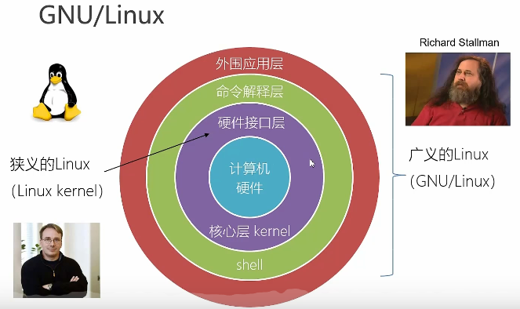

  

- Linux发行版本

  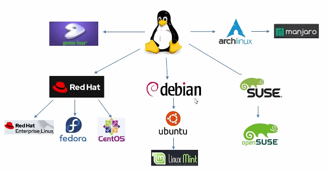

## Linux 基础篇

### 基础命令英文解释

- cd      **change directory**
- ls       **list**

### 桌面与终端

- 终端界面快捷键

  Ctrl + Alt +F2 ~F6 进入全屏终端（可以打开5个终端）

  Ctrl + Alt +F1 回到可视化界面

  > Ubantu
  >
  > > Ctrl + Alt +F7回到可视化界面
  > >
  > > Ctrl + Alt +F1 ~F6 进入全屏终端

- 终端界面解释

  

  root为当前账户名

  localhost为主机名

  ~ 代表当前目录名（目前代表/root）

### 文件系统

> linux 系统一些皆是文件

- Linux目录结构

  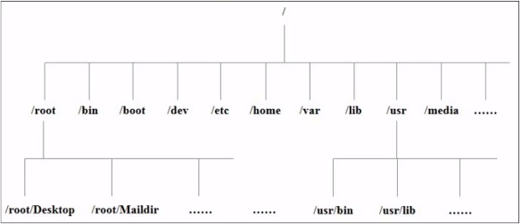

  类似树状的结构 更加扁平化 

- Linux 挂载点

  Linux的文件系统类型有ext4（CentOS 6所用）与xfs （CentOS 7所用）

  一块磁盘在Linux的文件目录下与windows不同

  一般一块磁盘在Linux下会有三个分区

  分区1为系统文件 挂载点在/boot目录下

  分区2为根目录文件 挂载点在/ 目录下

  分区3为swap 类似虚拟内存交换

  有新磁盘可以设置新的目录挂载到新的磁盘 即此目录下的文件将会写入到新磁盘

  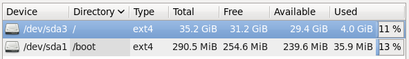

- 目录名的解释

  bin目录是binary的缩写 这个目录存放经常使用的二进制命令 （centos7 为超链接链接地址为/usr/bin）

  sbin目录是system binary的缩写 这个目录存放系统管理员使用的系统管理程序 （centos7 为超链接链接地址为/usr/sbin）

  lib目录为 library 库目录 为系统和应用程序提供所需要的库（centos7 为超链接）

  lib64目录为 64位的库目录 和lib相同 乱删系统都可能崩溃（centos7 为超链接）

  boot目录为系统引导包括镜像文件等

  dev为设备目录 里面可找到相应的硬件设备的映射

  etc为系统管理所需的配置文件

  home目录为主文件夹 是普通用户的文件夹 

  root为root用户的主文件夹

  opt为option目录 可选目录 给第三方软件包安装的地方

  media目录 媒体目录 识别可移动设备 可移动设备的挂载点

  mnt和media类似 同为移动设备挂载点

  proc目录为process目录 系统内存进程的映射 存放硬件进程信息 对系统重要

  run目录 运行目录 存放当前系统运行以来的所有实时信息 重启就被清除

  srv目录 系统服务相关 与本地服务有关

  sys目录 系统硬件信息相关文件 

  tmp目录临时目录 临时存放

  var目录 可变目录 不断会变化的文件 如log日志文件放在此

### vim编辑器

> 一般模式 主要删除，复制，粘贴
>
> 编辑模式 注意编辑文本
>
> 命令模式 选择保存退出

- 一般模式

  u 回滚 撤销当前操作

  x 剪切

  X 往前剪切

  r 单个字母的替换

  R 一个一个的字母的单词替换

  $移动文字到本行末尾

  ^移动文字到本行开头

  w切换下一个单词开头    b切换上一个单词开头 

  e切换下一个单词词尾

  gg或者H跳到文本

  G或L跳到最后一行

  n + G跳到第n行开头

  yy 复制本行 

  （数字n+yy 复制n行）

  （y+$复制光标之后的文字到本行末尾）

  （y+^复制光标之前的文字到本行开头）

  （y+w复制光标所在单词）

  p 粘贴

  （数字n+p 粘贴n行）

  dd 删除本行

  （数字n+dd删除n行）

  （d+$删除光标之后的文字到本行末尾）

  （d+^删除光标之前的文字到本行开头）

  （d+w删除光标所在单词）
  
  
  
- 插入模式

  i 在当前光标前插入

  a在当前光标后插入

  o在当前光标的下一行

  I在当前光标行最前面插入
  
  A在当前光标行最后面插入
  
  O在当前光标的上一行

- 命令模式

  ：w保存

  ：q推出

  ：q！强制推出

  ：wq保存推出

  ：set nu显示行号

  ：set nonu取消显示行号

  /单词 查找单词 n下一个 N上一个

  ：s/old/new 当前行第一个old替换为new

  ：s/old/new/g 当前行所用old替换为new

  ：%s/old/new 每一行第一个old替换为new

  ：%s/old/new/g 所有old替换为new

### 网络配置

> 查看ip地址 ifconfig （interface config）
>
> 重启网络服务 service network restart
>
> centos7两个网络服务networkmanager(新) 和 network(旧 centos6)同时存在，但最好不要同时处于活跃状态，centos7推荐用新网络服务

- 桥接模式 （本质是局域网的扩展）

  优点：架构简单 网络平等 直接由主机搭建网桥访问外网

  缺点：占用ip 安全性（隐私）差 局域网内都可以访问

- NAT模式 （network address translation）（本质是局域网的套娃）

  优点：安全 外网无法访问进虚拟子网 pc主机和虚拟机用虚拟网卡（vmnetap8）交互，可用静态ip（防止重启ip被重新分配）

  缺点：有网速被主机占用的可能 

  

- 仅主机模式

  用虚拟网卡（vmnetap1）让虚拟机与主机共享一个专用网络，虚拟机无法与外网通讯

- 更改主机名

  hostname 查看

  vim /etc/hostname 修改主机名 重启后生效

  hostnamectl set-hostname 新名字   修改主机名 不用重启(centOS 7)

  

- 集群的通常设置

  NAT模式
  
  vim /etc/sysconfig/network - scripts/ifcfg - 以太网卡名字   在ipadder 写入静态ip 
  
  systemctl restart NetworkManager重启网络服务 （可关闭network服务 centos6所用）
  
  在host更改主机名
  
  xshaell的配置

### 系统管理

>一个正在执行的程序或命令，叫“进程” 具有独特的PID
>
>启动后一直存在，常驻内存的进程，叫”服务“

- 服务管理(centOS 6)

  service 服务名 start|stop|restart|status  服务 开启|停止|重启|状态

  查看服务的方法ls /etc/init.d/

  chkconfig 查看所有服务自启配置

  chkconfig (--level n) 服务名 on|off 打开|关闭指定服务(级别n)的自动启动

  chkconfig 服务名 --list 查看服务开机启动状态

- 服务管理(centOS 7 兼容centos 6)

  systemctl start|stop|restart|status 服务名 

  查看所有服务的方法ls /usr/lib/systemd/system

  systemctl status 服务名(firewalld) 查看系统(防火墙)服务状态

  systemctl enable|disable 服务名(firewalld.service)   开启|关闭服务(防火墙)的自动启动

  systemctl list- unit- files 查看所有服务自启配置

- 系统运行级别(centOS 6 )

  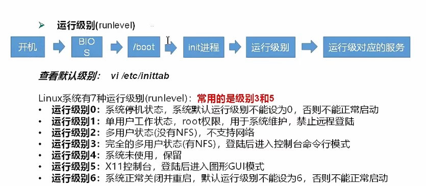

  查看运行级别 在 /etc/inittab

  

- 系统运行级别(centOS 7)

  

  systemctl get-default  查看当前运行级别

  systemctl set-default  TARGET.target 修改当前运行级别（TARGET取multi-user或graphcal）

  init 3去到运行级别3（无gui界面） init 5去到运行级别5（有gui界面） exit可退出

- 关机重启

  > 默认一分钟会执行sync命令 将数据由内存同步到硬盘 手动保存更靠谱

  shutdown 关机 n分钟后关机默认一分钟 

  shutdown n  n分钟后关机默认一分钟 

  shutdown 12:12 几点几分关机

  shotdown now 立马关机

  halt 停机，关闭系统 但不断电

  poweroff 关机断电

  reboot 重启系统

## Linux实操篇

> man + 命令   可以查看命令的完整手册
>
> type + 命令   可以查看命令类型
>
> help + 命令   只能得到bash内置命令的手册
>
> 命令 --help    只能外部得到命令的简略的手册
>
> which 命令   当前命令path目录下的位置
>
> where is 命令   查找命令位置 源文件等
>
> ctrl + c 停止进程
>
> ctrl + l  清屏 等于clear  （reset完整清屏 类似重启终端）

### 文件目录类

- 查看和切换目录

  pwd 打印工作目录 （print working directory）

  pwd -P 显示实际路径（查软连接实际路径）

  cd + 绝对路径 或者相对路径   切换目录

  cd -P 进入实际路径（查软连接实际路径）

  su + 用户名 切换用户 （switch user）

  

- 列出目录内容

  ls -a 显示所有内容 （list all）（ . . 为上级目录   . 为当前目录     .文件名为隐藏文件）

  ls -l 显示具体内容 （list long）（本质等于ll命令）
  
  ls -lh 显示内容加文件大小

- 创建与删除

  mkdir + 名字 + 名字    可在当前目录创建文件夹

  mkdir + /路径与名字    可在指定路径创建文件夹

  mkdir -p + /路径       一路创建

  rmdir（remove directory）同上 （只能删空目录）

  touch /路径加文件  创建文件 （不带后缀默认也是文本文件）

  vim 新文件名 创建文本 但不执行:w 就不会存在

  

- 复制文件或目录

  cp a /路径  复制a到某路径 文本可以选择覆盖文本 在cp前加\表示直接执行不询问直接执行原生命令 cp是cp -i的别名 在type cp可查
  
  cp -r a/ /路径 复制a文件夹里面的所有文件到路径 -r表示递归

- 删除文件或目录

  rm a   删除文件a  rm是rm -i的别名  单独rm无法删除目录

  rm -r  a  删除a文件夹 -r递归

  rm -f a  强制删除不提醒

  rm -rf  a   强制递归删除

  > rm -rf   /*  删库跑路      /*表示根目录下所有

- 移动文件与目录重命名

  mv oldname newname  重命名
  
  mv 文件名 /路径 移动文件到路径（可同时更改名字）

- 查看文件内容

  cat  文件 （catch）查看文件内容  -n 显示行号（小文本可以方便查看）

  more  文件 全屏查看文件内容 空格翻页 回车下一行 =显示行号 f下一屏 b上一屏  q退出（适合长文本）

  less 文件 全屏查看文件内容 空格翻页 pgdn 下一页  pgup 上一页 回车下一行 q退出  =显示目前详情   /文本  可向下搜索文本      ？文本  可向下搜索文本（适合超长文本）
  
  wc 文件 查看文件行数 单词数 字节数（word count）

- echo

  echo 文本    输出文本到控制台

  echo -e “文本” 加转义字符在文本内输出    \n 换行符  \t制表符 加双引号可保留原格式

  echo $ 按tab  查看系统环境变量

  echo $path 查看系统path环境变量

- 输出重定向

  ls -l  >  文件    ls -l输出的覆盖到文件中 （没有文件会自动创建）

  ls -l  >>  文件    ls -l输出的追加到文件中（没有文件会自动创建）

  cat 文件  > 文件  将文件覆盖到文件

  echo “内容”  >> 文件    将输出的内容写入文件中

  

- 显示文件头部尾部内容

  head 文件 查看文件头10行内容

  head -n x 文件   查看文件头x行内容

  tail 文件  查看文件尾10行内容

  tail -n x 文件   查看文件尾x行内容

  tail -f 文件 （f代表follow） 追踪监控文字更新 ctrl 加s 暂停  ctrl 加q 继续 ctrl 加c 退出    另一终端不能对之前内容修改或覆写  跟踪的文件的索引号inode（ls -i 文件可以查看）vim修改会修改文件索引号 导致无法追踪

  

- 软链接

  > 软连接类似快捷方式 有数据块 存放的内容是另一文件的路径名的指向 原文件删除受影响
  >
  > 硬链接类似镜像副本 类似复制 指向inode号  不会占用实际空间  会同步内容 删一个其他也可以打开  ln不加-s就是硬链接

  ln -s /路径和文件或目录 /路径或链接文件名字   取路径的文件或目录 当作链接的指向 （link）

  rm 软链接 可直接删除软链接

  rm -rf 软链接/  直接删除软链接下的真实路径的文件 软链接也失效

  

- 查看执行过的历史命令

  history n显示  刚刚执行的n条命令

  ！历史编号  可直接执行历史编号的命令 

  history -c 清空历史 

### 时间日期类

- 显示时间

  date +%Y-%m-%m-%H-%M-%S   显示当前年月日时间 可单独使用

  date +%s  显示1970年到现在的时间戳 秒数

  date -d  ‘1 days ago’   显示前一天时间  单位可以变 数字也可以变

  date -d  ‘-1 days ago’   显示后一天时间

  date -s “xxxx-xx-xx xx:xx:xx”  设置系统时间到xxxx

  cal -n   显示当前左右共n个月份日历 

  cal -m  将星期一显示最前

  cal 年份 显示年份的全日历

  cal -y 显示本年的全日历

### 用户管理类

- 用户

  >  cd /home/ 然后ls查看普通用户个数 普通用户主目录是/home/用户名（用户名和主目录名称可以不一样）  root用户是/root

  useradd  用户名    添加新用户

  useradd -d /主目录路径和名称 用户名 不同与用户名的主目录和用户名

  userdel 用户名  删除用户名 （用户不在了  用户名的主目录还在）

  userdel -r 用户名  删除用户名和用户名的主目录

  useradd   -g 组名 用户名    添加新用户到某个组（不加-g会重新分一组只有一个用户）

  passwd 新用户  给新用户添加密码 

  id 用户名 显示uid gid 组

  less /etc/passwd  查看所有用户  有系统用户  新建用户在最后

  su 用户名 切换用户   （switch user） exit退出 su 的用户   层层嵌套

  who am i 查看当前真正用户是谁  

  whoami 查看当前用户是谁

- 设置普通用户具有root权限

  sudo 加命令临时获取root权限

  vim /etc/sudoers 要添加普通用户名 普通用户名才可以执行sudo

  

- 用户组的管理

  groupadd 组名 （需要管理员）

  cat /etc/group 查看用户组的id

  usermod -g 组名 用户名   添加用户名到已有组名中

  groupmod -n 新组名 旧组名 给组名改名字 （modify）

  groupdel 用户名的用户组 （新建时用户名会存在新的用户组）

  在wheel组可以执行管理员命令 可以在/etc/group中修改sudo不要密码

  

### 文件权限类

​		第0位 d表示目录 -表示普通文件 l表示链接 c表示字符类型设备文件（鼠标键盘等）  b表示块设备文件（硬盘等）

​		r代表read 读取 查看

​		w代表 write 修改 但是不代表可以删除文件 删除文件的前提是对该文件所在的目录文件有写的权限 才可以删除该文件

​		x代表可执行文件或可进入该目录权限 execute 可以被系统执行

​		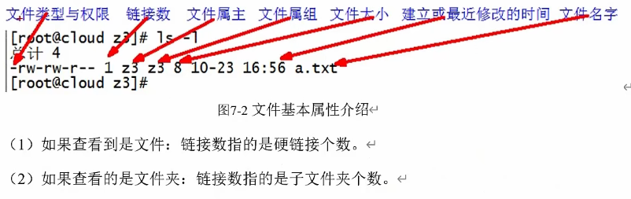

- 改变文件权限

  chmod ugoa +-= rwx 改变文件权限（change modify user|group|other|all 增加减少或等于 read write execute）

  r = 4   w= 2  x = 1  （二进制 000和111的十进制表示）

  chmod 777 文件或目录  赋予文件777的权限

  chmod -R 777 目录/  递归赋予777权限给目录下的所有文件

  

- 改变文件所有者

  chown 属主 文件名 改变文件所有者 也可加-R递归改变

- 改变文件所属组

  chgrp 组名 文件名    改变文件所属组

### 文件查找类

- 查找文件或目录

  find -name 名字（“*.txt”）    按名字找在当前路径的内与之匹配的文件 （递归寻找）

  find /路径 -name 名字 按名字找在路径的内与之匹配的文件

  find /路径 -user 用户名  按用户名查找路径下它所属的文件

  find /路径 -size  +10M 寻找在路径下大于10M的文件（+可换- 代表小于）

  updatedb 更新文件数据库（locate无需便利文件系统 直接在数据库定位文件 查询速度快 数据库默认日更一次）

  locate 关键字  可以在该路径下于之关键词匹配的文件路径 

  

- grep过滤查找及|管道符

  grep -n 关键字 文本名   在文本中找关键字（-n显示行号）

  ls | grep 关键字 将ls的结果再寻找关键词 （|将两个代码串在一起 起筛选过滤作用）

### 压缩解压类

- gzip与gunzip（只能压缩 不能归纳）

  gzip 文件 将文件压缩为*.gz文件

  gunzip 文件.gz  解压文件

  > 只能压缩文件 不能压缩目录
  >
  > 不保留原来的文件
  >
  > 同时多个文件会产生多个压缩包 （单一压缩工具）

- zip与unzip

  zip 压缩文件名 文件1 文件2 或者/路径  将文件1和2压缩到压缩文件中（路径需要-r递归压缩 压缩到目录内所有文件）

  unzip -d /路径 压缩文件.zip  解压文件 （-d可添加指定目录）

- tar包（tar只归纳 默认不内存压缩）

  tar -zcvf 文件.tar.gz 打包的文件   打包文件成.tar.gz

  > -c  产生.tar 打包文件
  >
  > -v  显示详情信息
  >
  > -f  指定打包后的文件名
  >
  > -z 同时gz压缩
  >
  > -x 解包.tar文件

  tar -zxvf 文件.tar.gz -C  /路径 将文件解压到路径（压缩包的文件直接在路径中）

  

### 磁盘管理类

> tree ./ 查看当前路径树状图 （yum install tree）

- 查看文件和目录占用的磁盘空间

  du 目录或文件 查看当前路径所有文件的大小（disk usage）

  > 加-h  以gb mb kb显示大小 默认为字节

  > 加-a 不仅查看子目录，还有包括文件

  > 加-c 显示所有文件和大小后显示后 显示总和 （du命令输出的最后一行）

  > 加-s 只显示总和

  > 加--max-depth=n 指定子目录深度到第n层

  du -sh 显示当前路径目录的大小

  du --max-depth=1 -ah 显示当前目录下深度为1的大小

- 查看磁盘空间使用情况

  df -h 查看磁盘占用信息

  > tmpfs 临时的文件系统
  >
  > /dev/shm  share memory
  >
  > /run 运行时有关的东西
  >
  > devtmpfs /dev 在linux内核启动创建的挂载点 用来管理linux所有设备的

  free -h 查看当前物理内存和虚拟内存

- 查看设备挂载情况

  lsblk    查看设备挂载情况（list block）（-f显示文件系统信息xfs或ext4等）

  > sda sata硬盘或scsi硬盘
  >
  > hda ide硬盘
  >
  > vda 虚拟化的
  >
  > sr0 光驱rom

- 光盘挂载与卸载

  mount /dev/cdrom 新挂载点    将光驱挂挂载到新的挂载点
  
  umount /dev/cdrom  卸载光驱挂载
  
  > 设置开机自动挂载
  >
  > vim /ect/fstab
  >
  > 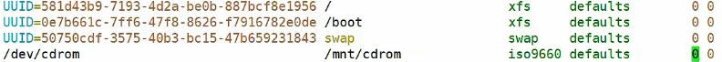
  >
  > 第一个0表示是kdump备份  第二个0是fsck文件检查的优先级
  
  

- 新磁盘分区与设置类型最后挂载（需要root）

  fdisk -l   查看磁盘分区详情

  fdisk 硬盘设备名 （可能为/dev/sdb）  对新增硬盘进行分区（按p打印分区表 再按n选择分区类型 p为主分区（只能有4个主分区 编号sda1-4） e为扩展分区 编号围为5-16 按p划分为主分区 最好w保存退出

  > 插入新增硬盘需要重启linux

  mkfs -t xfs /dev/sdb1   格式化设置文件类型为xfs  （make filesystem) 

  mount /dev/sdb1 挂载路径   设置挂载将挂载路径的文件写入sdb1

### 进程管理类

> 常驻内存的就叫服务 有前台与后台之分 后台服务需要守护进程后缀是d.service 守护进程与系统服务是一一对应的关系

- 查看当前系统进程状态（ps静态）

  ps aux   | grep xxxx    显示系统中进程 （a列出带有终端的所有用户的进程 x列出当前用户的所有进程 u显示友好的风格 不加-为BSD风格）

  > ps aux  | less

  > 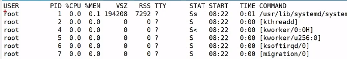
  >
  > vsz指进程占用的虚拟内存kb
  >
  > rss指进程占用的物理内存kb
  >
  > tty指该进程在那个终端运行的  tty1是图形化界面   tty2-6是本地字符界面终端       pts/0-255指虚拟终端       （？指没终端）
  >
  > stat 进程状态 R运行 S睡眠 T暂停 Z僵尸（马上结束 等待父进程结束） s包含子进程 l多线程 +前台显示 <优先级高 N表示优先级低
  >
  > time 占用cup运算时间
  >
  > command 命令路径

  ps -ef | grep xxxx或pid  可以查看子父进程之间的关系 （-e 列出所有进程   -f 显示完整格式列表 -u显示某个用户关联的所有进程 加-的为unix风格）（pid 进程id号  ppid进程的父进程id）

  > 看cpu占有率和内存占用率用aux 看父进程id用ef

- 终止进程

  kill pid号 可终止进程（-9强迫停止）

  killall 关键词 关闭所有有关键词的进程

  

- 查看进程树

  pstree | less（yum install pstree）查看进程树 （-p显示pid -u显示进程所属用户）

- 实时监控系统进程状态（top动态）

  top （-d n刷新秒数为n 默认为3秒刷新 -i不显示闲置或将死进程 -p pid 监视单个pid的进程） 

  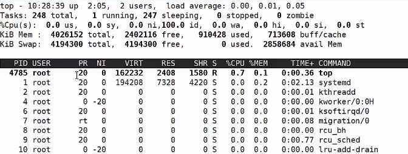

  2 user（图形化界面也算一个root用户）

  0.00，0.01，0.05 表示平均负载  一分钟 五分钟  十五分钟之内

  0.0 us 用户进程  0.0sy 系统进程 0.0ni 友善（nice）进程 在cpu里的时间占比

  99.9id 空闲比  0.0wa 等待时间占比 0.0hi硬件中断请求时间占比   0.0si软件中断请求时间占比  0.0st被虚拟化占的时间占比

  PR 任务调度优先级 NI当前进程用户指定NICE值 VIRT 虚拟内存占用大小 RES 实际内存占比大小 SHR共享内存 S 指状态  

  默认排序是按cpu占比  按M以内存占比排序 P以cpu占比排序  N按进程号从小到大排序 按pgup pgdn翻页  按u可以选择查看一个用户的进程 按k可以kill进程 然后按 9 就是强行停止

- 查看网络状态和端口占用信息

  netstat -anp | grep 进程号   查看该进程网络信息

  > 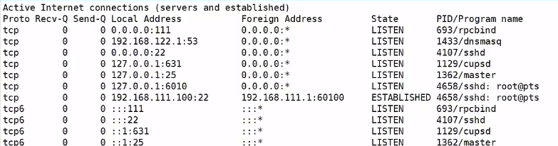
  >
  > proto 协议 tcp协议与tcp6（ipv6）协议
  >
  > recv-q 连接到socket已接收但没拷贝的字节数
  >
  > send-q 发出去主机还未确认收到的字节数 
  >
  > local address本地   IP：端口      0.0.0.0表示本机本地所有地址   127.0.0.1 本地回环地址 类似localhost
  >
  > foreign address  外围地址

  netstat -nlp | grep 端口号  查看网络端口号占用情况

  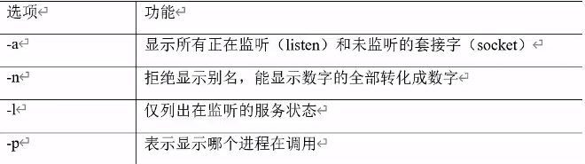

- 系统定时任务（确保crond在runnign）

  crontab -l    查看crontab任务

  crontab -e   编辑crontab任务

  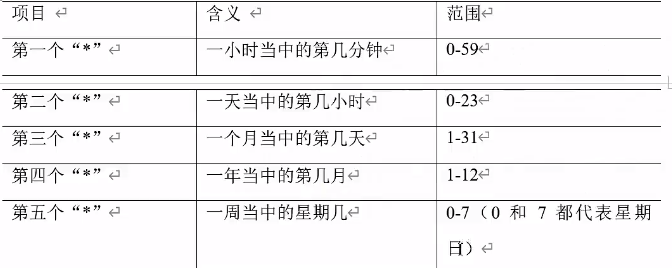

  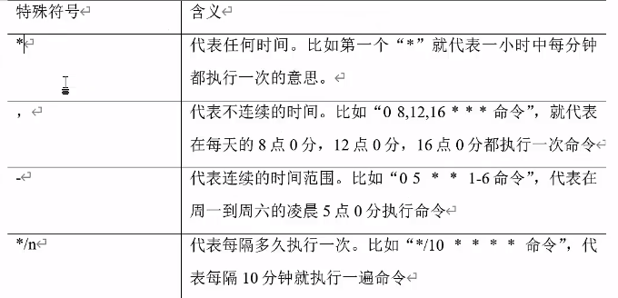

  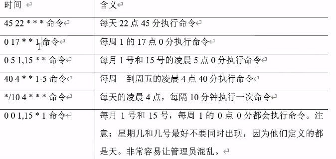

  

  crontab -r  删除当前任务所有crontab任务

  

## Linux扩展篇

### 软件包管理

- RPM（redhat package manager）

  > debian系列 ubantu是apt
  >
  > 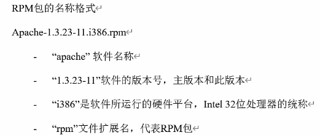

  rpm -qa  查询安装的所有rpm软件包

  rpm -qi 软件名  软件的详细信息

  rpm -e rpm软件包  卸载软件

  rpm -e -nodeps 软件包   卸载软件 不检查依赖关系  使用该软件包的软件可能不能正常工作（nodeps  no dependence）

  rpm -ivh rpm软件包   安装软件包（-i安装 -v显示详情 -h进度条 --nodeps 安装前不检查依赖）

  

- YUM（yellow dog updater modified）

  > yum解决了rpm安装常缺少依赖的问题

  yum -y 参数      （-y表示一路yes）
  
  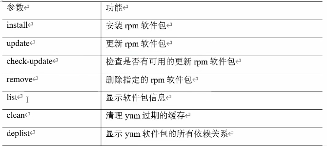
  
  修改yum源
  
  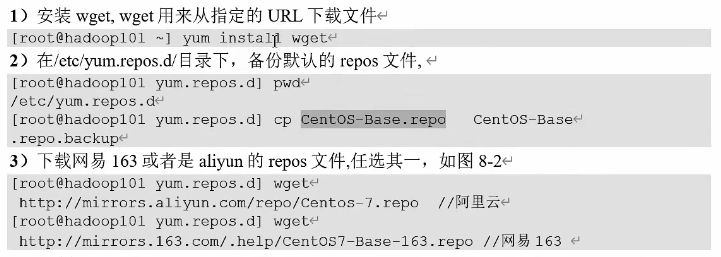
  
  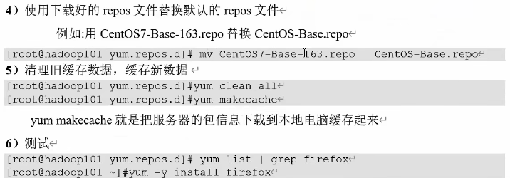

### 克隆虚拟机

在VMware克隆后设置集群

### Shell编程

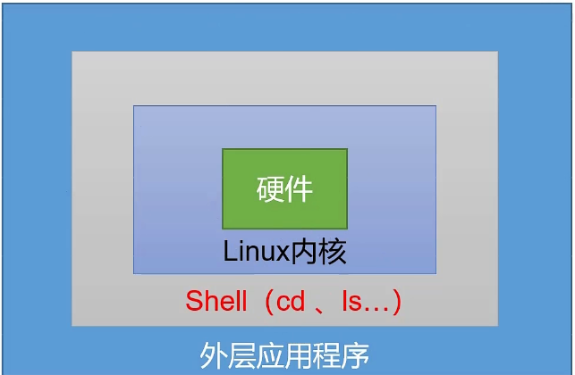

> shell解释器是bash  （ubantu是dash）

- 脚本格式

#!/bin/bash       开头   （#！指定解析器）

> \# 内容      表示注释

- 执行脚本

  > 当前shell执行与子shell执行区别在于环境变量的继承关系 子shell的变量 父shell不可见  （ps -f查看父子进程关系）

sh 脚本或路径 （sh指向bash 也可以用bash 脚本 本质一样 不需要x权限 sh bash参数传入去执行 子shell的bash去执行）

直接绝对路径或相对路径（注相对路径需要./shell文件 且需要x权限 子shell的bash去执行 ）

source 脚本或路径 （借助cshell csh执行 当前shell执行）

点空格shell文件  （当前shell执行）

.

- 变量

  > 系统变量 用户变量
  >
  > 全局变量 局部变量

  set 查看所有变量 

  $变量名  引用变量

  echo $PATH  查看系统环境变量

  

- 自定义变量

  变量名=变量值    定义变量  （默认局部变量  有空格需要用引号括起来 等号两侧不能有空格 默认类型是字符串）

  >  在父bash有的变量在子bash没有则是局部变量 设置全局需要在父bash中执行export 变量名
  >
  > 在子bash内修改父bash的全局变量 对父bash不生效

  readonly 变量名=变量值   设置只读变量 不能更改

  unset 变量名  删除变量 不能删除只读变量

- 特殊变量

  $n  (n为数字 $0为脚本的路径加名字 基于运行时是相对还是绝对 $1-$9代表第一到第九个参数 十以上的参数 需要用大括号 ${10})

  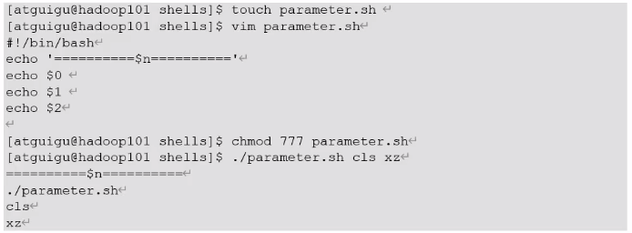

  $# (获取输入参数个数 )

  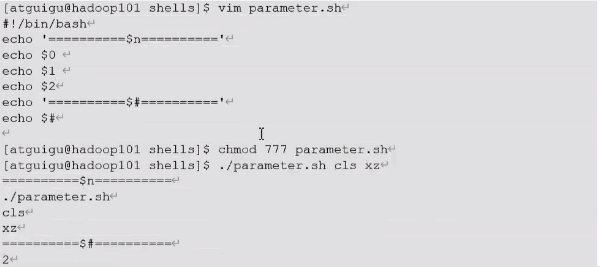

  $* (代表命令行所有参数 $*把所有参数看成一个整体)

  $@ (代表命令行所有参数 $@把所有参数区分对待 类似数组)

  > 当$*没有被双引号引起来 效果和$@一样 引起来就有区别了
  >
  > 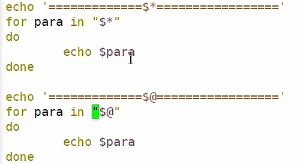
  >
  > 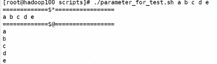

  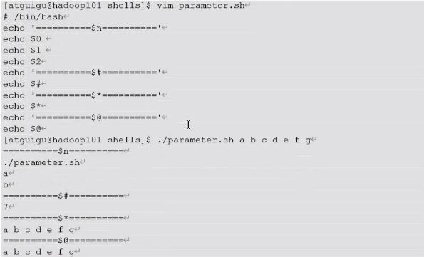

  $? (返回上一条命令执行状态的结果 正确执行返回0  返回非0异常运行)

  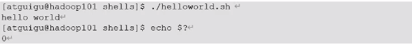

  

- 运算符

  >expr 1 + 2  可以计算值得到3  之间需要有空格 运算符可以用 +  -  \\*  /

  $[运算式]或$((运算式)) （之间空格可有可无   +  -  *   /）

  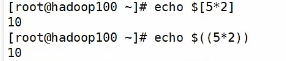

  > a = $(expr 5 \\* 2) 或  a=\`expr 5 \\* 2\`     命令替换 利用函数  最简单的还是a=$[5*2]    输出都是10

  ***统一记忆规则*** 

  ***[ 内容 ]      左右一律加空格 英文间接代替数学符号***

  ***((内容))      不加左右空格 可直接使用数学符号***

  

- 条件判断

  test 条件   用echo $?来看真假  0为真 非0为假

  [  条件 ]      括号两端需要空格  也用echo $?查看真假    [ 乱值 ] 返回0  [ 空值 ] 返回1

  > 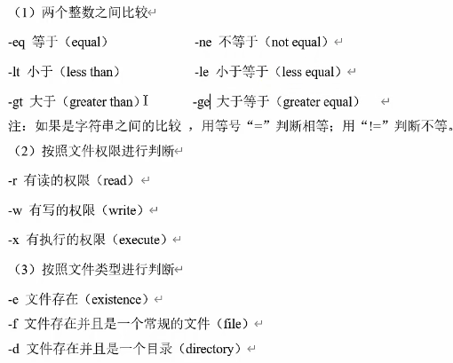
  >
  > 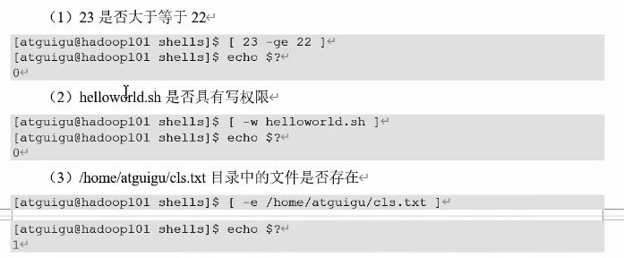
  >
  > 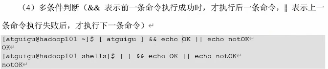

  

- 流程控制

  - if单分支判断（二叉树）

    if [ 条件判断式 ] ; then 代码; fi  （一行写完执行需要分号）（if后有空格）

    或者

    if [ 条件判断式 ] ; then 

    ​		代码

    fi 

    或者

    if [ 条件判断式 ] 

    ​		then 代码

    fi  （关键词换行了就不需要分号了）

    > 当需要传入参数防止报错做如下操作 （字符拼接） 
    >
    > 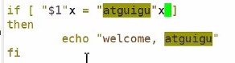

    逻辑与连接 （-a表示and  -o表示or）

    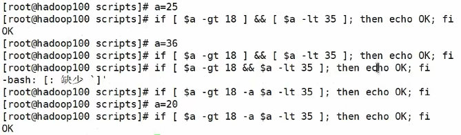

    

  - if多分枝 （二叉树嵌套）

    if [ 条件判断式 ]

    then

    ​		程序

    elif [ 条件判断式 ]

    then

    ​		程序

    else

    ​		程序

    fi

    （可以有多个elif）

    

  - case语句  （单层n叉数）

    case $变量名 in

    "值1"）

    ​        如果变量等于值1 则执行这里的程序1

    ；；

    "值2"）

    ​        如果变量等于值2 则执行这里的程序2

    ；；

    *）

    ​        如果变量都不是以上的值 则执行这里的程序 

    ；；

    esac

    注意

    case 行尾单词必须为单词 in  每一个匹配以）结束

    双分号类似break 

    *） 类似dafault

    

  - for循环

    for ((初始值；循环控制条件；变量变化))

    do

    ​        程序

    done

    举例（从1加到传入的数）（双括号内可之间用数学符号）

    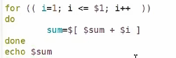

    或者

    for 变量 in 值1  值2  值3  ...

    do

    ​        程序

    done

    举例

    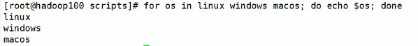

    举例（从1加到传入的数）（ {1...100}表示的是1到100 ）

    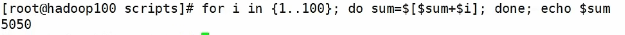

    

  - while循环

    while [ 条件 ]

    do

    ​        程序

    done

    举例（从1加到传入的数）（let 为新写法 注释的是老写法  +=左右不能有空格）

    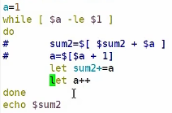

    

- 读取控制台的输入

  read 变量名  （-t n 指定等待时间n秒 -p 指定读取值的提示符）
  
  例如
  
  read -t 7 -p “enter your name：”  nm
  
  echo $nm
  
  

- 函数

  > 函数调用需要$(命令)来命令替换

  basename /路径加文件  后缀（.txt）     只显示最后的文件名   （不写后缀就显示后缀）本质切分

  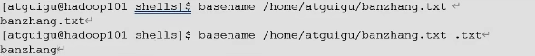

  dirname /路径加文件   显示文件之前的路径   （注意 用相对路径时显示相对路径）本质切分

  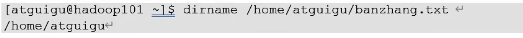

- 自定义函数

  > 调用函数之前 要声明函数 
  >
  > 函数返回值 只能通过$?获得 不加return 将以最后一条命令运行结果作为返回值 return后跟数值n（0-255）

  function 名字（）{

  ​		程序；

  ​		return n；

  }

  举例

  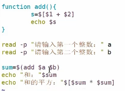

  

- 文件归档

  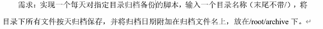

  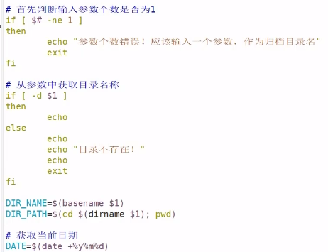
  
  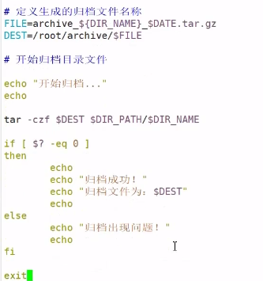
  
  crontab -e 创建定时任务
  
  
  
  
  
- 正则表达式

  ^  匹配一行的开头

  cat /etc/passwd |grep ^a

  $   匹配一行的结尾

  cat /etc/passwd | grep bash$

  （^$ 匹配空行）

  . 匹配任意字符 （占一个字符）

  cat /etc/passwd | grep r..t

  *表示上一个字符出现0词或多次

  cat /etc/passwd | grep ro*t（rt rot root rooot等）

  （ .*  匹配任意长度的字符串）

  字符区间  [ ]

  [6,8]表示6或者8

  [0-9]表示一个0-9的数字

  [0-9]*  表示任意长度的数字字符串

  [a-z]表示一个a-z的字母

  [a-z]* 表示任意长度的字母字符串

  [a-c,e-f] 表示匹配一个a-c或e-f的之间的任意字符

  转义字符 \ 需要用单引号‘\’来转义

  > {次数} 重复之前的表达 grep需要加   -E

  

- 文本处理工具

  cut 剪 剪切字节，字符或字段 （分隔符不好改变）

  cut 文件名  （可加-f 列号  加n表示去第几行    -d 分隔符 读取文件的分割符  默认是“\t”  -c是按字符切割 加n表示去第几列

  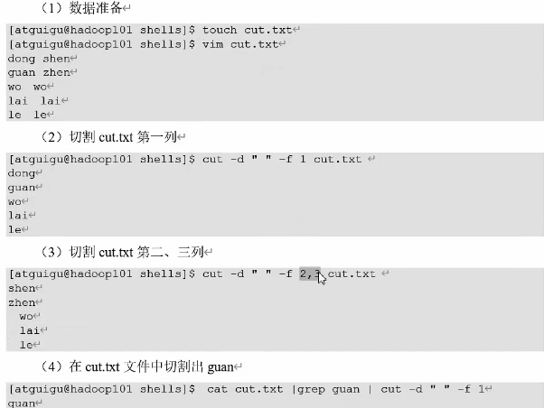

  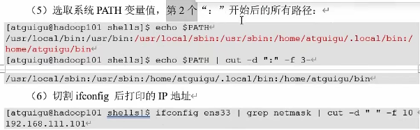

  

  awk 读入以空格将每行切片 （可以用print方法改变分割符）

  awk 选项 ‘/内容匹配要求/{执行内容}  重复之前’ 文件名 （选项可加-F 指定输入分隔符如“ : ”   -v 赋值一个用户定义变量）
  
  > cat 加 awk执行 行加列的操作
  >
  > cat 加 grep 和 cut 分布操作行列
  
  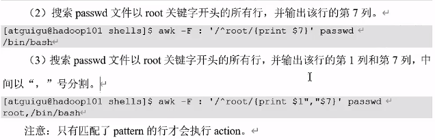
  
  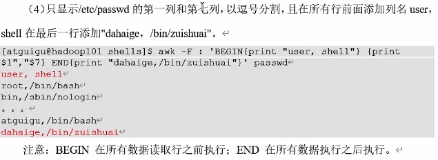
  
  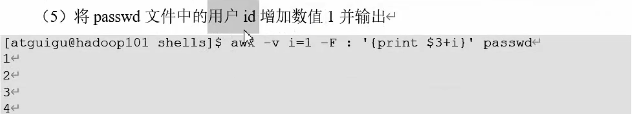
  
  awk内置变量
  
  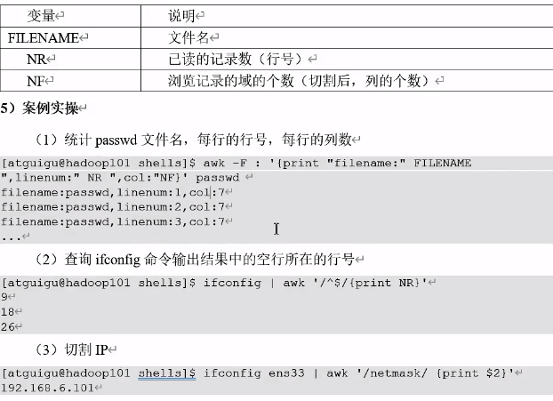

- 发送信息

  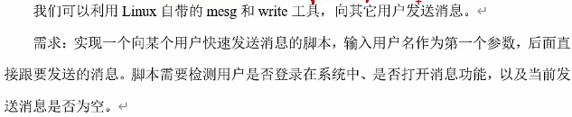

  mesg   如出现is y表示消息功能打开（is n表示关闭mesg y打开 mesg n关闭）

  who -T 出现+号也表示打开

  write 用户名 pts/几  然后就可以向其他主机发送信息（-i忽略大小写  -m 1有多个只选第一个 -z判断是否空

  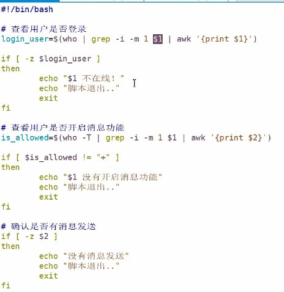

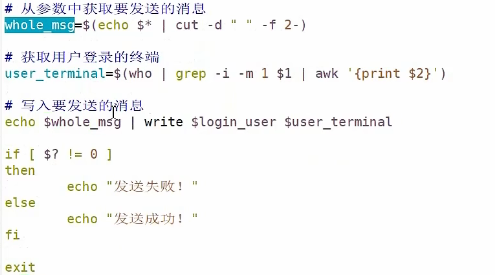

